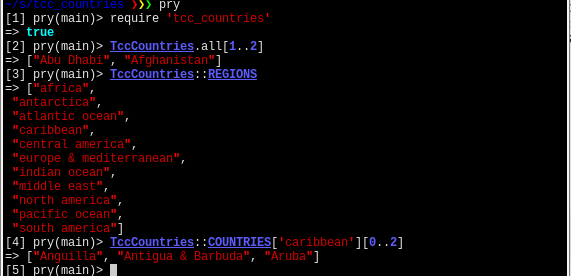

# TccCountries

This gem gives you all of the countries recognised by the Travelers Century Club (TCC), organised by region.

This data comes from [their website](https://travelerscenturyclub.org/countries-and-territories) and exists here purely to save you from having to parse this out yourself.

## Installation

Add this line to your application's Gemfile:

```ruby
gem 'tcc_countries'
```

And then execute:

    $ bundle

Or install it yourself as:

    $ gem install tcc_countries

## Usage

```ruby
require 'tcc_countries'
TccCountries.all # an Array of all TCC countries
TccCountries::REGIONS # an Array of all TCC regions
TccCountries::COUNTRIES # a Hash of all TCC countries with the regions as keys
```



## Development

After checking out the repo, run `bin/setup` to install dependencies. Then, run `rake spec` to run the tests. You can also run `bin/console` for an interactive prompt that will allow you to experiment.

To install this gem onto your local machine, run `bundle exec rake install`. To release a new version, update the version number in `version.rb`, and then run `bundle exec rake release`, which will create a git tag for the version, push git commits and tags, and push the `.gem` file to [rubygems.org](https://rubygems.org).

## Contributing

Bug reports and pull requests are welcome on GitHub at https://github.com/wheresalice/tcc_countries. This project is intended to be a safe, welcoming space for collaboration, and contributors are expected to adhere to the [Contributor Covenant](http://contributor-covenant.org) code of conduct.

## License

The data is © 2019 The Travelers' Century Club

The gem is available as open source under the terms of the [MIT License](https://opensource.org/licenses/MIT).

## Code of Conduct

Everyone interacting in the TccCountries project’s codebases, issue trackers, chat rooms and mailing lists is expected to follow the [code of conduct](https://github.com/wheresalice/tcc_countries/blob/master/CODE_OF_CONDUCT.md).
